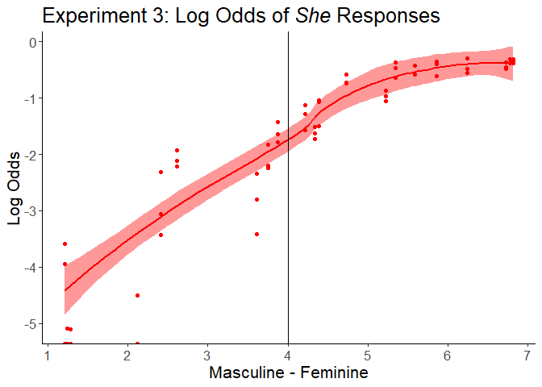
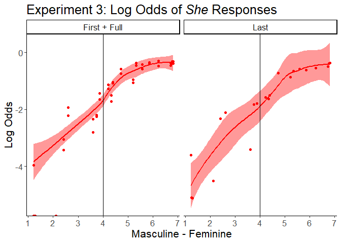

Experiment 3: Supplementary Analyses
================
Bethany Gardner
4/05/2022

-   [Setup](#setup)
-   [Quadratic Name Gender Rating](#quadratic-name-gender-rating)
    -   [Model](#model)
    -   [Main quadratic effect](#main-quadratic-effect)
    -   [Quadratic interaction](#quadratic-interaction)
-   [Participant Gender](#participant-gender)
    -   [Setup/Data Summary](#setupdata-summary)
    -   [Model](#model-1)

# Setup

Load data and select columns used in model. See data/exp3_data_about.txt
for more details.

``` r
d <- read.csv("../data/exp3_data.csv", stringsAsFactors=TRUE) %>%
  rename("Participant"="SubjID", "Item"="Name") %>%
  select(Participant, SubjGender, Condition, 
         GenderRating, Item, He, She, Other)

str(d)
```

    ## 'data.frame':    8904 obs. of  8 variables:
    ##  $ Participant : Factor w/ 1272 levels "R_020UOb05Lb0EtX3",..: 216 216 216 216 216 216 216 41 41 41 ...
    ##  $ SubjGender  : Factor w/ 7 levels "agender","asexual",..: 4 4 4 4 4 4 4 3 3 3 ...
    ##  $ Condition   : Factor w/ 3 levels "first","full",..: 1 1 1 1 1 1 1 1 1 1 ...
    ##  $ GenderRating: num  5.22 1.24 5.86 3.75 6.78 4.34 2.41 6.24 2.61 6.82 ...
    ##  $ Item        : Factor w/ 63 levels "Ashley Cook",..: 6 9 13 43 47 52 62 2 16 20 ...
    ##  $ He          : int  0 1 0 0 0 0 1 0 1 0 ...
    ##  $ She         : int  0 0 1 0 1 1 0 0 0 1 ...
    ##  $ Other       : int  1 0 0 1 0 0 0 1 0 0 ...

Center gender rating for names: Original scale from 1 to 7, with 1 as
most masculine and 7 as most feminine. Mean-centered with higher still
as more feminine.

``` r
d %<>% mutate(GenderRatingCentered=scale(d$GenderRating, scale=FALSE))
```

Set contrasts for name conditions. This uses Scott Fraundorf’s function
for weighted contrasts. (The psycholing package version doesn’t support
doing 2v1 comparisons, only 1v1.) Condition1 is Last vs First+Full.
Condition2 is First vs Full.

``` r
source("centerfactor.R") 
contrasts(d$Condition) <- centerfactor(d$Condition, c("last","first"))
contrasts(d$Condition)
```

    ##             [,1]        [,2]
    ## first  0.4009434 -0.48113208
    ## full   0.4009434  0.51886792
    ## last  -0.5990566  0.01886792

# Quadratic Name Gender Rating

The second supplementary analysis tested the quadratic effect of name
gender rating, such that larger values meant names with stronger gender
associations (masc or fem), and smaller values meant names with weaker
gender associations.

``` r
d %<>% mutate(GenderRatingSquared=GenderRatingCentered^2)
```

## Model

Quadratic name gender effect on the likelihood of *she* responses, as
opposed to *he* and *other* responses. The maximal model includes random
intercepts by item, but not by participant.

``` r
m.quad <- buildmer(
  formula=(She ~ Condition*GenderRatingCentered + Condition*GenderRatingSquared +
          (1|Participant) + (1|Item)), 
  d, family="binomial", direction=c("order"), quiet=TRUE)
summary(m.quad)
```

    ## Generalized linear mixed model fit by maximum likelihood (Laplace
    ##   Approximation) (p-values based on Wald z-scores) [glmerMod]
    ##  Family: binomial  ( logit )
    ## Formula: She ~ 1 + GenderRatingCentered + GenderRatingSquared + Condition +  
    ##     GenderRatingCentered:Condition + GenderRatingSquared:Condition +  
    ##     (1 | Item)
    ##    Data: d
    ## 
    ##      AIC      BIC   logLik deviance df.resid 
    ##   7979.5   8050.4  -3979.7   7959.5     8894 
    ## 
    ## Scaled residuals: 
    ##     Min      1Q  Median      3Q     Max 
    ## -2.1120 -0.5443 -0.1467  0.6532 15.2267 
    ## 
    ## Random effects:
    ##  Groups Name        Variance Std.Dev.
    ##  Item   (Intercept) 0.3002   0.5479  
    ## Number of obs: 8904, groups:  Item, 63
    ## 
    ## Fixed effects:
    ##                                 Estimate Std. Error  z value Pr(>|z|) Pr(>|t|)
    ## (Intercept)                     -1.09643    0.11101 -9.87643    0.000  < 2e-16
    ## GenderRatingCentered             1.06982    0.05554 19.26236    0.000  < 2e-16
    ## GenderRatingSquared             -0.11378    0.03102 -3.66732    0.000 0.000245
    ## Condition1                       0.23784    0.07935  2.99748    0.003 0.002722
    ## Condition2                       0.05570    0.09965  0.55893    0.576 0.576208
    ## GenderRatingCentered:Condition1  0.22179    0.06115  3.62713    0.000 0.000287
    ## GenderRatingCentered:Condition2 -0.11288    0.08816 -1.28044    0.200 0.200391
    ## GenderRatingSquared:Condition1  -0.09635    0.02976 -3.23767    0.001 0.001205
    ## GenderRatingSquared:Condition2   0.03866    0.04184  0.92410    0.355 0.355432
    ##                                    
    ## (Intercept)                     ***
    ## GenderRatingCentered            ***
    ## GenderRatingSquared             ***
    ## Condition1                      ** 
    ## Condition2                         
    ## GenderRatingCentered:Condition1 ***
    ## GenderRatingCentered:Condition2    
    ## GenderRatingSquared:Condition1  ** 
    ## GenderRatingSquared:Condition2     
    ## ---
    ## Signif. codes:  0 '***' 0.001 '**' 0.01 '*' 0.05 '.' 0.1 ' ' 1
    ## 
    ## Correlation of Fixed Effects:
    ##             (Intr) GndrRC GndrRS Cndtn1 Cndtn2 GRC:C1 GRC:C2 GRS:C1
    ## GndrRtngCnt -0.093                                                 
    ## GndrRtngSqr -0.638 -0.252                                          
    ## Condition1  -0.005 -0.007  0.007                                   
    ## Condition2  -0.007  0.014 -0.005  0.029                            
    ## GndrRtnC:C1  0.021  0.212 -0.189 -0.143  0.018                     
    ## GndrRtnC:C2  0.001 -0.099  0.078  0.018 -0.146 -0.090              
    ## GndrRtnS:C1 -0.018 -0.191  0.175 -0.424 -0.032 -0.657  0.078       
    ## GndrRtnS:C2  0.003  0.086 -0.073 -0.031 -0.361  0.081 -0.723 -0.053

## Main quadratic effect

To make this easier to understand, plot the data converted to log odds.
This includes just what the model is testing: *she* responses, no
effects of Condition included yet.

``` r
d.log <- d %>% group_by(Condition, GenderRating) %>%
         summarise(He.Mean=mean(He),
                   She.Mean=mean(She),
                   Other.Mean=mean(Other)) %>%
  mutate(He.Log=log(He.Mean),
         She.Log=log(She.Mean),
         Other.Log=log(Other.Mean)) %>%
  mutate(Condition_Model=case_when(
    Condition=="first" ~ "First + Full",
    Condition=="full" ~ "First + Full",
    Condition=="last" ~ "Last"
  ))
```

``` r
plot.quad_all <- ggplot(d.log, aes(x=GenderRating)) +
  geom_smooth(aes(y=She.Log), fill="red", color ="red") +
  geom_point(aes(y=She.Log), fill="red", color ="red") +
  geom_vline(xintercept=4) +
  theme_classic() +
  labs(title="Experiment 3: Log Odds of *She* Responses", 
       x="Masculine - Feminine", 
       y="Log Odds") +
  theme(text=element_text(size=16),
        plot.title=element_markdown()) 
plot.quad_all
```

    ## `geom_smooth()` using method = 'loess' and formula 'y ~ x'

<!-- -->
At the masculine end of the scale, *she* responses decrease more
linearly. At the feminine end of the scale, *she* responses level off at
around 5.5 (mostly feminine), then don’t ever reach 0. Fewer *she*
responses in 6-7 range than *he* responses in 1-2 range.

## Quadratic interaction

Now, plot the comparison for the Last vs First+Full condition
interaction.

``` r
plot.quad_cond <- ggplot(d.log, aes(x=GenderRating)) +
  geom_smooth(aes(y=She.Log), fill="red", color ="red") +
  geom_point(aes(y=She.Log), fill="red", color ="red") +
  geom_vline(xintercept=4) +
  facet_wrap(~Condition_Model) +
  theme_classic() +
  labs(title="Experiment 3: Log Odds of *She* Responses", 
       x="Masculine - Feminine", 
       y="Log Odds") +
  theme(text=element_text(size=16),
        plot.title=element_markdown()) 
plot.quad_cond
```

    ## `geom_smooth()` using method = 'loess' and formula 'y ~ x'

<!-- -->

# Participant Gender

## Setup/Data Summary

The third supplementary analysis looks at participant gender: if male
participants show a larger bias towards *he* responses than non-male
participants.

Participants entered their gender in a free-response box.

``` r
d %>% group_by(SubjGender) %>% 
  summarise(total=n_distinct(Participant)) %>% kable()
```

<table>
<thead>
<tr>
<th style="text-align:left;">
SubjGender
</th>
<th style="text-align:right;">
total
</th>
</tr>
</thead>
<tbody>
<tr>
<td style="text-align:left;">
agender
</td>
<td style="text-align:right;">
1
</td>
</tr>
<tr>
<td style="text-align:left;">
asexual
</td>
<td style="text-align:right;">
1
</td>
</tr>
<tr>
<td style="text-align:left;">
female
</td>
<td style="text-align:right;">
638
</td>
</tr>
<tr>
<td style="text-align:left;">
male
</td>
<td style="text-align:right;">
514
</td>
</tr>
<tr>
<td style="text-align:left;">
N/A
</td>
<td style="text-align:right;">
115
</td>
</tr>
<tr>
<td style="text-align:left;">
non-binary
</td>
<td style="text-align:right;">
2
</td>
</tr>
<tr>
<td style="text-align:left;">
Prefer not to say
</td>
<td style="text-align:right;">
1
</td>
</tr>
</tbody>
</table>

For this analysis, we exclude participants who did not respond. Because
there are not enough participants to create 3 groups, we compare male to
non-male participants.

``` r
d.gender <- d %>% filter(SubjGender != "N/A") %>%
            filter(SubjGender != "Prefer not to say") %>%
            mutate(SubjGenderMale=(ifelse(SubjGender=="male", 1, 0)))

d.gender %>% group_by(SubjGenderMale) %>% 
  summarise(total=n_distinct(Participant)) %>% kable()
```

<table>
<thead>
<tr>
<th style="text-align:right;">
SubjGenderMale
</th>
<th style="text-align:right;">
total
</th>
</tr>
</thead>
<tbody>
<tr>
<td style="text-align:right;">
0
</td>
<td style="text-align:right;">
642
</td>
</tr>
<tr>
<td style="text-align:right;">
1
</td>
<td style="text-align:right;">
514
</td>
</tr>
</tbody>
</table>

Summary of responses by condition and participant gender.

``` r
d.gender %<>% mutate(ResponseAll=case_when(
              He==1 ~ "He",
              She==1 ~ "She", 
              Other==1 ~ "Other"))

d.gender.count_responses <- d.gender %>% 
  group_by(Condition, ResponseAll, SubjGenderMale) %>%
  summarise(n=n()) %>%
  pivot_wider(names_from=c(ResponseAll),
              values_from=n) %>%
  mutate(She_HeOther = She / (He+Other),
         She_He = She / He) %>%
  rename("ParticipantGender"="SubjGenderMale") 
d.gender.count_responses$ParticipantGender %<>% recode("0"="Non-male", "1"="Male")

kable(d.gender.count_responses)
```

<table>
<thead>
<tr>
<th style="text-align:left;">
Condition
</th>
<th style="text-align:left;">
ParticipantGender
</th>
<th style="text-align:right;">
He
</th>
<th style="text-align:right;">
Other
</th>
<th style="text-align:right;">
She
</th>
<th style="text-align:right;">
She_HeOther
</th>
<th style="text-align:right;">
She_He
</th>
</tr>
</thead>
<tbody>
<tr>
<td style="text-align:left;">
first
</td>
<td style="text-align:left;">
Non-male
</td>
<td style="text-align:right;">
463
</td>
<td style="text-align:right;">
393
</td>
<td style="text-align:right;">
453
</td>
<td style="text-align:right;">
0.5292056
</td>
<td style="text-align:right;">
0.9784017
</td>
</tr>
<tr>
<td style="text-align:left;">
first
</td>
<td style="text-align:left;">
Male
</td>
<td style="text-align:right;">
429
</td>
<td style="text-align:right;">
415
</td>
<td style="text-align:right;">
374
</td>
<td style="text-align:right;">
0.4431280
</td>
<td style="text-align:right;">
0.8717949
</td>
</tr>
<tr>
<td style="text-align:left;">
full
</td>
<td style="text-align:left;">
Non-male
</td>
<td style="text-align:right;">
482
</td>
<td style="text-align:right;">
367
</td>
<td style="text-align:right;">
467
</td>
<td style="text-align:right;">
0.5500589
</td>
<td style="text-align:right;">
0.9688797
</td>
</tr>
<tr>
<td style="text-align:left;">
full
</td>
<td style="text-align:left;">
Male
</td>
<td style="text-align:right;">
371
</td>
<td style="text-align:right;">
344
</td>
<td style="text-align:right;">
335
</td>
<td style="text-align:right;">
0.4685315
</td>
<td style="text-align:right;">
0.9029650
</td>
</tr>
<tr>
<td style="text-align:left;">
last
</td>
<td style="text-align:left;">
Non-male
</td>
<td style="text-align:right;">
724
</td>
<td style="text-align:right;">
544
</td>
<td style="text-align:right;">
601
</td>
<td style="text-align:right;">
0.4739748
</td>
<td style="text-align:right;">
0.8301105
</td>
</tr>
<tr>
<td style="text-align:left;">
last
</td>
<td style="text-align:left;">
Male
</td>
<td style="text-align:right;">
498
</td>
<td style="text-align:right;">
482
</td>
<td style="text-align:right;">
350
</td>
<td style="text-align:right;">
0.3571429
</td>
<td style="text-align:right;">
0.7028112
</td>
</tr>
</tbody>
</table>

Participant gender is mean centered effects coded, comparing non-male
participants to male participants.

``` r
d.gender$SubjGenderMale %<>% as.factor()
contrasts(d.gender$SubjGenderMale)=cbind("NM_M"=c(-.5,.5)) 
contrasts(d.gender$SubjGenderMale)
```

    ##   NM_M
    ## 0 -0.5
    ## 1  0.5

## Model

Effects of Name Condition (first name, full name), the first name’s
Gender Rating (centered, positive=more feminine), and Participant Gender
(non-male vs. male) on the likelihood of a *she* response as opposed to
*he* or *other* responses. The maximal model contains random intercepts
by item and by participant.

``` r
m.gender_all <- buildmer(
  formula= (She ~ Condition * GenderRatingCentered * SubjGenderMale + 
           (1|Participant) + (1|Item)), 
  data=d.gender, family=binomial, 
  direction=c("order"), quiet=TRUE)

summary(m.gender_all)
```

    ## Generalized linear mixed model fit by maximum likelihood (Laplace
    ##   Approximation) (p-values based on Wald z-scores) [glmerMod]
    ##  Family: binomial  ( logit )
    ## Formula: She ~ 1 + GenderRatingCentered + SubjGenderMale + Condition +  
    ##     GenderRatingCentered:Condition + SubjGenderMale:Condition +  
    ##     GenderRatingCentered:SubjGenderMale + GenderRatingCentered:SubjGenderMale:Condition +  
    ##     (1 | Item) + (1 | Participant)
    ##    Data: d.gender
    ## 
    ##      AIC      BIC   logLik deviance df.resid 
    ##   7061.6   7159.6  -3516.8   7033.6     8078 
    ## 
    ## Scaled residuals: 
    ##     Min      1Q  Median      3Q     Max 
    ## -3.0837 -0.4716 -0.1392  0.5318  9.8646 
    ## 
    ## Random effects:
    ##  Groups      Name        Variance Std.Dev.
    ##  Participant (Intercept) 0.7527   0.8676  
    ##  Item        (Intercept) 0.4478   0.6692  
    ## Number of obs: 8092, groups:  Participant, 1156; Item, 63
    ## 
    ## Fixed effects:
    ##                                                     Estimate Std. Error
    ## (Intercept)                                         -1.58004    0.10545
    ## GenderRatingCentered                                 1.14763    0.06289
    ## SubjGenderMaleNM_M                                  -0.33908    0.09599
    ## Condition1                                           0.19527    0.09836
    ## Condition2                                           0.13618    0.12205
    ## GenderRatingCentered:Condition1                      0.11311    0.05254
    ## GenderRatingCentered:Condition2                     -0.07906    0.06655
    ## SubjGenderMaleNM_M:Condition1                        0.12026    0.19714
    ## SubjGenderMaleNM_M:Condition2                        0.04670    0.24325
    ## GenderRatingCentered:SubjGenderMaleNM_M             -0.01729    0.05160
    ## GenderRatingCentered:SubjGenderMaleNM_M:Condition1   0.09439    0.10525
    ## GenderRatingCentered:SubjGenderMaleNM_M:Condition2  -0.04577    0.13265
    ##                                                      z value Pr(>|z|) Pr(>|t|)
    ## (Intercept)                                        -14.98390    0.000  < 2e-16
    ## GenderRatingCentered                                18.24796    0.000  < 2e-16
    ## SubjGenderMaleNM_M                                  -3.53234    0.000 0.000412
    ## Condition1                                           1.98527    0.047 0.047114
    ## Condition2                                           1.11575    0.265 0.264530
    ## GenderRatingCentered:Condition1                      2.15265    0.031 0.031346
    ## GenderRatingCentered:Condition2                     -1.18807    0.235 0.234805
    ## SubjGenderMaleNM_M:Condition1                        0.60999    0.542 0.541870
    ## SubjGenderMaleNM_M:Condition2                        0.19201    0.848 0.847738
    ## GenderRatingCentered:SubjGenderMaleNM_M             -0.33515    0.738 0.737512
    ## GenderRatingCentered:SubjGenderMaleNM_M:Condition1   0.89678    0.370 0.369837
    ## GenderRatingCentered:SubjGenderMaleNM_M:Condition2  -0.34504    0.730 0.730061
    ##                                                       
    ## (Intercept)                                        ***
    ## GenderRatingCentered                               ***
    ## SubjGenderMaleNM_M                                 ***
    ## Condition1                                         *  
    ## Condition2                                            
    ## GenderRatingCentered:Condition1                    *  
    ## GenderRatingCentered:Condition2                       
    ## SubjGenderMaleNM_M:Condition1                         
    ## SubjGenderMaleNM_M:Condition2                         
    ## GenderRatingCentered:SubjGenderMaleNM_M               
    ## GenderRatingCentered:SubjGenderMaleNM_M:Condition1    
    ## GenderRatingCentered:SubjGenderMaleNM_M:Condition2    
    ## ---
    ## Signif. codes:  0 '***' 0.001 '**' 0.01 '*' 0.05 '.' 0.1 ' ' 1
    ## 
    ## Correlation of Fixed Effects:
    ##                (Intr) GndrRC SbGMNM_M Cndtn1 Cndtn2 GRC:C1 GRC:C2 SGMNM_M:C1
    ## GndrRtngCnt    -0.300                                                       
    ## SbjGndMNM_M     0.090 -0.063                                                
    ## Condition1     -0.016  0.005 -0.054                                         
    ## Condition2     -0.032  0.029  0.012    0.002                                
    ## GndrRtnC:C1    -0.001  0.014  0.022   -0.519  0.015                         
    ## GndrRtnC:C2     0.030 -0.042  0.001    0.014 -0.507 -0.015                  
    ## SbGMNM_M:C1    -0.027  0.012 -0.036    0.191  0.017 -0.125 -0.004           
    ## SbGMNM_M:C2     0.005  0.002 -0.047    0.017  0.133 -0.004 -0.100 -0.001    
    ## GnRC:SGMNM_M   -0.062  0.074 -0.517    0.023  0.001 -0.039  0.008  0.019    
    ## GRC:SGMNM_M:C1  0.008 -0.011  0.018   -0.125 -0.003  0.176  0.012 -0.520    
    ## GRC:SGMNM_M:C2  0.003  0.000  0.042   -0.004 -0.100  0.013  0.129  0.015    
    ##                SGMNM_M:C2 GnRC:SGMNM_M GRC:SGMNM_M:C1
    ## GndrRtngCnt                                          
    ## SbjGndMNM_M                                          
    ## Condition1                                           
    ## Condition2                                           
    ## GndrRtnC:C1                                          
    ## GndrRtnC:C2                                          
    ## SbGMNM_M:C1                                          
    ## SbGMNM_M:C2                                          
    ## GnRC:SGMNM_M    0.042                                
    ## GRC:SGMNM_M:C1  0.015     -0.001                     
    ## GRC:SGMNM_M:C2 -0.506     -0.066       -0.016

-   Male participants less likely to produce *she* responses overall

-   No interactions with participant gender significant
